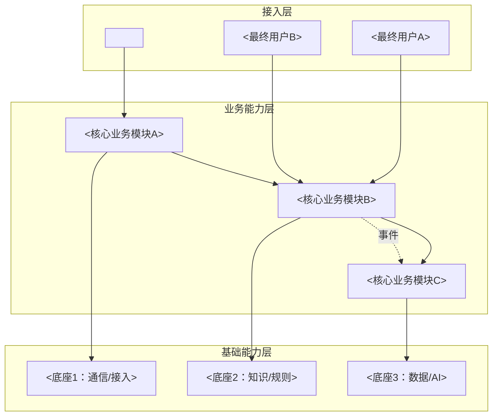
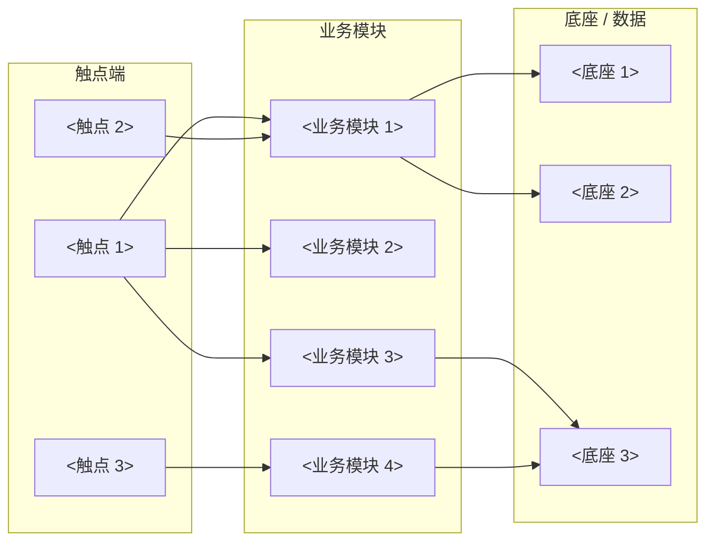

# AICoding 架构设计 · 高层架构设计

> 本文档为《AICoding 架构设计》核心产物之一，对应**高层架构设计模版**。
> 上游输入：业务原始诉求 + 行业调研结论 + 现有架构知识库；
> 下游输出：驱动《系统设计》《部署设计》《安全设计》《UserStory》四份文档的撰写。

---

## 模版使用说明（必读）

> ⚠️ **本文件是「模版」而非真实设计稿**。所有文字、表格、图示中出现的业务内容（如"投诉场景 / 坐席工作台 / T3C / 实时辅助"等）**仅作为示意，便于读者理解填写思路**，并不代表当前项目的真实业务范围。

**约定的占位符 / 示例标记**：

| 标记 | 含义 | 处理方式 |
| --- | --- | --- |
| `<...>` 或 ``<...>`` | 占位符，需替换为真实业务取值 | **必须**替换或删除 |
| `示例：` / `例：` 前缀 | 仅作为填写参考的示例 | **必须**替换为真实内容，或整行删除 |
| `YYYY-MM-DD` / `<n>` / `<x>` | 待填具体日期 / 数字 | **必须**替换为真实数值 |
| 标注「**示例·仅供参考**」的表格/图 | 整段为示例 | **必须**整体重写为真实业务内容 |

**填写纪律**：
1. 文档定稿前，全文不允许残留 `<...>`、`示例：` / `例：`、`YYYY-MM-DD`、`TBD` 等占位标识。
2. 表格中的示例行可以直接覆盖，但**列结构（表头）不允许删除**——它代表了硬性约束。
3. 章节中的"硬指标"段落**不是示例**，是该章节产出物必须满足的合格基线，需保留。
4. 附录 A / B 描述的是生成方法论与工具清单，属于元信息，**不需要按业务替换**。

**领域示例的来源**：本模版示例多以"客服 / 投诉 / 坐席工作台"为背景，仅因当前项目（AICalling）的领域而便于举例，**任何业务领域均可套用**本模版骨架。

---

## 0. 元信息：修订记录

> 记录文档版本、变更内容、修订人、修订时间，确保设计文档的可追溯。

```yaml
标题: <系统名> - 高层架构设计 v<MAJOR.MINOR>
版本: v0.1
状态: Draft   # Draft | Reviewing | Approved | Deprecated
创建日期: YYYY-MM-DD
最后更新: YYYY-MM-DD
作者: <姓名 / 角色>
评审人:
  - <姓名 / 架构师>
  - <姓名 / 业务负责人>

关联文档:
  上游输入:
    - 业务原始诉求 / PRD: <链接>
    - 行业调研报告: <链接 / 归档路径>
    - 现有架构知识库: <memory/architecture.json 或链接>
  下游产出:
    - 系统设计: <AICoding架构设计-2-系统设计.md>
    - 部署设计: <AICoding架构设计-3-部署设计.md>
    - 安全设计: <AICoding架构设计-4-安全设计.md>
    - UserStory: <AICoding架构设计-5-UserStory.md>
```

| 版本 | 日期 | 作者 | 变更内容 | 评审状态 |
| --- | --- | --- | --- | --- |
| v0.1 | YYYY-MM-DD | `<作者>` | 初稿 | Draft |

> **版本管理纪律**：破坏性变更（章节结构调整 / 关键决策反转）升 MAJOR；新增章节、扩充内容升 MINOR。

---

## 1. 需求概要

### 1.1 需求概要说明

> 一句话描述本期需求要解决的核心业务问题、覆盖的业务场景与服务对象。

**填写要点**（≤ 200 字，包含 3 个要素）：
1. **业务现状**：当前业务/产品/用户规模或所处阶段。
2. **触发事件**：触发本期需求的关键事件（新场景接入 / 老系统问题 / 战略调整）。
3. **系统定位一句话**：本系统在产品矩阵中的位置（与 §4.2 系统定位澄清呼应）。

> 示例：`<系统名> 用于解决 <业务问题>，服务于 <核心角色>，覆盖 <核心场景>。本期由 <触发事件> 驱动启动。`

### 1.2 关键决策摘要

> 列出本期最关键的 3 ~ 5 项设计决策（含范围决策、技术选型决策、MVP / 完整版边界决策）。

> **示例·仅供参考**：下表行内容均为示意，需根据真实业务重写。表头与"决策类别"分类建议保留。

| 编号 | 决策类别 | 决策内容 | 关联章节 |
| --- | --- | --- | --- |
| D1 | 范围决策 | `<例：本期只覆盖 XX 场景，YY 不在范围内>` | §6.1 需求边界 |
| D2 | 技术选型决策 | `<例：核心能力采用 X + Y + Z 混合方案>` | §3.2 / §4 |
| D3 | MVP / 完整版边界 | `<例：MVP 仅覆盖核心模块，扩展能力延后>` | §4.3 |
| D4 | 复用 vs 新建 | `<例：底座复用现有平台，业务系统新建>` | §5.2 |
| D5 | 部署形态 | `<例：私有化 / SaaS / 混合云>` | §5.2 / 部署设计 |

**硬指标**：≥ 3 条，≤ 5 条；每条决策必须能映射到正文具体章节。

### 1.3 价值主张

> 明确本系统/本期需求对业务的核心价值贡献（效率、合规、收入、成本、体验等维度）。

> **示例·仅供参考**：下表行内容为示意。"价值维度"分类（效率/合规/收入/成本/体验）建议保留作为思考框架，具体指标按真实业务定。

| 价值维度 | 量化目标 | 度量指标 | 当前值 | 目标值 | 截止时间 |
| --- | --- | --- | --- | --- | --- |
| 效率 | `<例：核心操作处理时长降低>` | `<度量指标>` | `<现状值>` | `<目标值>` | `<MVP 上线后 N 月>` |
| 合规 | `<例：关键事件 100% 留痕>` | `<完整率 / 覆盖率>` | `<-->` | `<100%>` | `<MVP 上线>` |
| 收入 | `<例：转化率 / 挽留率提升>` | `<业务指标>` | `<x%>` | `<y%>` | `<完整版上线>` |
| 成本 | `<例：单次调用成本控制>` | `<单位成本>` | `<-->` | `≤ <目标值>` | `<MVP 上线>` |
| 体验 | `<例：终端用户满意度>` | `<NPS / CSAT 等>` | `<-->` | `≥ <分>` | `<完整版上线>` |

**硬指标**：业务价值 ≥ 2 条 + 技术/成本价值 ≥ 1 条；每条必须可量化，禁止出现"提升 / 优化 / 加强 / 更好"等模糊词。

---

## 2. 需求分析 & 痛点解构

### 2.1 核心角色关注点

> 按"甲方决策者 / 最终用户 / 受影响方"维度盘点角色诉求。

> **示例·仅供参考**：下表行内容为示意（取客服领域举例）。**三大维度分类必须保留**，但具体角色与诉求按真实业务重写。

| 角色 | 业务身份 | 主要操作 | Top1 关心点 | 来源 |
| --- | --- | --- | --- | --- |
| `<甲方决策者>` | `<业务负责人 / 总监>` | `<决策 / 看板审阅>` | `<业务结果 / ROI>` | PRD §x.x |
| `<最终用户 A>` | `<一线操作人员>` | `<核心操作>` | `<效率 / 体验>` | PRD §x.x |
| `<最终用户 B>` | `<管理人员>` | `<监控 / 干预>` | `<风险时效 / 管控手段>` | PRD §x.x |
| `<受影响方：终端客户>` | `<C 端用户>` | `<触达本系统的方式>` | `<等待 / 解决率>` | PRD §x.x |
| `<受影响方：合规/运维>` | `<合规 / SRE>` | `<审计 / 监控>` | `<留痕 / 可用性>` | 合规规范 |

**硬指标**：≥ 3 类（甲方决策者 / 最终用户 / 受影响方各至少一行）；每行必须有"Top1 关心点"，禁止笼统写"使用方便"。

### 2.2 核心痛点

> 以 P1 / P2 / P3 ... 的优先级编码，列出本期需要解决的关键痛点。

> **示例·仅供参考**：下表为示意，需根据真实业务重写痛点。

| 编号 | 痛点描述 | 现象 / 数据 | 影响角色 | 影响程度 | 优先级 |
| --- | --- | --- | --- | --- | --- |
| P1 | `<例：核心风险事件无法实时识别>` | `<事件占比 x%，识别滞后 ≥ N 分钟>` | `<相关角色>` | 高（合规风险） | P1 |
| P2 | `<例：依赖人工经验，新人上手慢>` | `<平均上手周期 N 周>` | `<相关角色>` | 中 | P2 |
| P3 | `<例：操作步骤多，处理时长偏长>` | `<单次处理 ≥ N 分钟>` | `<相关角色>` | 中 | P2 |

**优先级标准**：
- **P1**：直接影响业务核心流程或合规底线，不解决无法上线。
- **P2**：影响用户体验或运营效率，可在 MVP 后迭代。
- **P3**：体验型 / 长尾问题，列入完整版或后续版本。

**硬指标**：每条痛点必须有"现象 / 数据"佐证；P1 ≥ 1 条且必须在 §2.3 有对应目标。

### 2.3 期待目标

> 以 V1 / V2 / V3 ... 的形式列出可量化的业务目标，对齐核心痛点。

> **示例·仅供参考**：下表为示意，需根据真实业务重写目标，并保证每条都能反向对齐 §2.2 中的某条痛点。

| 编号 | 目标描述 | 对齐痛点 | 度量指标 | 当前值 | 目标值 | 截止时间 |
| --- | --- | --- | --- | --- | --- | --- |
| V1 | `<例：核心事件 ≤ N s 内识别推送>` | P1 | `<端到端时延 P99>` | `<现状>` | `<目标>` | MVP 上线 |
| V2 | `<例：人员上手周期减半>` | P2 | `<上手周期 / 周>` | `<现状>` | `<目标>` | 完整版上线 |
| V3 | `<例：处理时长降至 N 分钟内>` | P3 | `<处理时长>` | `<现状>` | `<目标>` | 完整版上线 |

**硬指标**：每条目标必须**有数字 + 对齐至少 1 条痛点**；P1 痛点必须有对应 V 级目标。

### 2.4 基线复用

> 现有架构 / 现有能力中可直接复用的组件、平台、模型、数据资产。

> **示例·仅供参考**：下表行内容为示意（部分行如 T3C 是 AICalling 项目自身的真实底座，其它为通用举例）。**复用类别**作为思考维度建议保留，具体能力按真实业务盘点。

| 复用类别 | 现有能力 | 复用方式 | 来源系统 | 备注 |
| --- | --- | --- | --- | --- |
| `<核心底座>` | `<例：通话 / 录音 / ASR>` | 直接调用 API | `<例：T3C>` | `<参考链接 / 文档>` |
| 知识库 | `<现有 FAQ 库 / 话术库>` | 接入 + 增量补齐 | `<系统>` | 需做向量化 |
| 用户中心 | `<SSO / 权限>` | 直接对接 | `<内部 IAM>` | — |
| 数据资产 | `<历史业务日志>` | 离线训练 + 在线召回 | `<大数据平台>` | 需脱敏 |
| 监控告警 | `<现有 APM / 日志>` | 直接复用 | `<监控平台>` | 需新增业务指标 |

**硬指标**：必须先盘点再决定新建；凡列入"功能缺口"的能力，必须先在本节确认基线无法覆盖。

### 2.5 功能缺口

> 在现有基线之上仍需新建的功能能力（按业务阶段维度分组，如"事前 / 事中 / 事后 / 运营"或"通话前 / 中 / 后 / 运营"等）。

> **示例·仅供参考**：下表以"通话前 / 中 / 后 / 运营"为分组示意。**分组维度可按真实业务阶段调整**（如交易类业务可改为"下单前 / 下单中 / 下单后 / 售后"）。

| 阶段 | 功能缺口 | 必要性 | 优先级 | 对齐目标 |
| --- | --- | --- | --- | --- |
| `<事前阶段>` | `<例：智能路由 + 画像预加载>` | 必须 | MVP | V2 |
| `<事中阶段>` | `<例：实时风险识别 + 推荐推送>` | 必须 | MVP | V1 |
| `<事中阶段>` | `<例：管理人员实时干预>` | 重要 | MVP | V1 |
| `<事后阶段>` | `<例：自动工单 / 总结生成>` | 重要 | MVP | V3 |
| 运营 | `<例：趋势看板 + 归因分析>` | 重要 | 完整版 | V2 |

**硬指标**：每条缺口必须对齐 §2.3 至少一条目标；MVP 缺口必须在 §6.3 功能清单中对应有 MVP 范围标记。

---

## 3. 行业调研

### 3.1 行业标杆系统分析

> 对标行业内代表性产品/系统，输出标签化清单（场景覆盖、技术亮点、商业模式等）。

> **示例·仅供参考**：下表为骨架，需根据真实调研结果填入对应标杆。

| 标杆系统 | 厂商 / 来源 | 场景覆盖 | 技术亮点 | 商业模式 | 适用度 |
| --- | --- | --- | --- | --- | --- |
| `<标杆 A>` | `<厂商>` | `<场景>` | `<亮点>` | SaaS / 私有化 | 高 / 中 / 低 |
| `<标杆 B>` | `<厂商>` | `<场景>` | `<亮点>` | SaaS | 中 |
| `<标杆 C>` | `<厂商>` | `<场景>` | `<亮点>` | 开源 | 低 |

**硬指标**：≥ 3 家；至少包含 1 家头部 SaaS + 1 家开源/自研代表。

### 3.2 方案对标及优先级打分

> 横向对比矩阵 + 打分结果，得出对本期最具参考价值的方案集合。

**对比矩阵**（每行权重之和 = 1）：

> **示例·仅供参考**：下表的「评估维度」与「权重」是常用框架，可按真实业务调整。得分需根据真实调研结论填写。

| 评估维度 | 权重 | 标杆 A 得分 | 标杆 B 得分 | 标杆 C 得分 |
| --- | --- | --- | --- | --- |
| 场景契合度 | 0.30 | `<x>` | `<x>` | `<x>` |
| 技术成熟度 | 0.20 | `<x>` | `<x>` | `<x>` |
| 集成难度（反向）| 0.15 | `<x>` | `<x>` | `<x>` |
| 成本（反向） | 0.15 | `<x>` | `<x>` | `<x>` |
| 合规可控性 | 0.20 | `<x>` | `<x>` | `<x>` |
| **加权总分** | **1.00** | **`<总分>`** | **`<总分>`** | **`<总分>`** |

**结论摘要**：
- **优先借鉴**：`<方案>` —— 理由：`<…>`
- **部分借鉴**：`<方案>` —— 借鉴点：`<…>`
- **不借鉴**：`<方案>` —— 否决理由：`<…>`

### 3.3 完整报告参考

> 给出行业调研完整报告的链接或归档路径，供深度查阅。

- 完整报告链接：`<链接>`
- 调研工具：`tech-research-advisor`（见附录 B）
- 调研日期：YYYY-MM-DD
- 调研归档：`<docs/调研/...md>`

---

## 4. 方案决策

### 4.1 价值定位澄清

> 当前需求/系统对业务全局的价值贡献。

**定位三段式**（`对外 / 对内 / 差异化` 三段是固定结构，需保留；具体内容按真实业务填写）：

```
对外价值（客户侧）: <例：缩短业务处理周期，提升终端用户满意度>
对内价值（运营侧）: <例：一线提效 + 管理风险可控 + 合规留痕>
差异化价值        : <例：相对友商/现有方案的独有能力，需可量化或可证明>
```

**与产品矩阵的关系**：本系统在 `<产品矩阵 / 价值主线>` 中承担 `<核心职责>`，与 `<上下游模块>` 形成完整业务闭环（见 §5.2、§5.3）。

### 4.2 系统定位澄清

> 当前系统在产品矩阵 / 技术架构中的边界与上下游。

> **示例·仅供参考**：下表"维度"列为必填项骨架，"内容"列均为占位/示意，需替换为真实定位。

| 维度 | 内容 |
| --- | --- |
| 系统名称 | `<标准名，与术语表一致>` |
| 系统类型 | 新建 / 改造 / 已有系统扩展 |
| 部署形态 | SaaS / 私有化 / 混合 |
| 多租户 | 是（隔离粒度=`<租户/组织/客户实例>`）/ 否 |
| 服务对象 | `<角色清单，对齐 §2.1>` |
| 上游依赖 | `<系统 A、系统 B>`（详见 §5.2） |
| 下游消费者 | `<系统 X、系统 Y>`（详见 §5.2） |
| 边界（不做） | `<例：不做某能力，由其它系统承担>` |

### 4.3 MVP 与完整版决策

> 明确 MVP 范围、完整版范围、两者的演进关系，确保 MVP 不偏离完整版的整体框架。

> **示例·仅供参考**：下表的"架构差异点 / 退出标准"列举了一些常见模式（单 AZ、Mock、灰度等），需根据真实项目改写。

| 阶段 | 时间窗 | 范围（功能编号） | 架构差异点 | 退出标准 | 不做（延后） |
| --- | --- | --- | --- | --- | --- |
| MVP | W1 ~ W`<n>` | F1, F2, F3 | `<例：单 AZ / 单租户 / 三方 Mock>` | `<例：跑通核心场景 + 灰度 N 用户>` | F4 ~ F`<m>` |
| 完整版 | W`<n+1>` ~ W`<m>` | + F4 ~ F`<m>` | `<例：双 AZ / 多租户 / 真实三方>` | `<例：DAU N 稳定 30 天 + 99.95% 可用性>` | — |

**演进纪律**（重要）：
- ✅ MVP 的架构骨架必须是完整版的**子集**，不允许 MVP 上线后推倒重来。
- ✅ MVP 中可 Mock 的能力（如真实三方接口、复杂风控），需在本节明确"完整版替换计划"。
- ❌ 禁止：MVP 为了赶工而引入"完整版无法继承"的临时架构（如临时单库 → 完整版分库分表，需要数据迁移大改）。

---

## 5. 业务架构设计

### 5.1 业务架构图

> 形成系统级业务架构图，体现核心业务模块、流程方向、数据流。

**绘制规范**：
- 至少 3 层：**接入层（用户/触点）→ 业务能力层（核心模块）→ 基础能力层（底座/数据）**。
- 每个模块必须有**标准名**（与 §4.2 系统定位 / 后续术语表一致）。
- 数据流方向必须明确（实线 = 同步调用、虚线 = 异步事件、粗线 = 主链路）。

> **示例·仅供参考**：下方 Mermaid 图仅为「三层结构 + 数据流方向」的样式示例，节点名（U1/M1/B1 等）均为占位符，需根据真实业务架构整体重绘。



### 5.2 系统依赖架构

> 基于系统定位，明确上下游模块清单及交互方式（同步 / 异步 / 数据订阅）。

> **示例·仅供参考**：下表表头（依赖类型 / 接入方式 / 同步异步 / 关键约束）作为硬要求保留；具体行需根据真实依赖盘点重写。

| 依赖类型 | 系统 / 模块 | 提供方 | 依赖能力 | 接入方式 | 同步/异步 | 关键约束 |
| --- | --- | --- | --- | --- | --- | --- |
| 上游 | `<系统 A>` | `<团队>` | `<能力>` | HTTPS / REST | 同步 | `<超时 / 限流>` |
| 上游 | `<系统 B>` | `<团队>` | `<事件>` | MQ | 异步 | `<至少一次>` |
| 下游 | `<系统 X>` | `<团队>` | `<能力>` | gRPC | 同步 | `<幂等>` |
| 复用底座 | `<例：T3C>` | `<提供方>` | `<例：通话 / 录音 / ASR>` | API | 混合 | `<参考文档路径>` |
| 数据订阅 | `<数据平台>` | `<团队>` | 离线标签 | 数据订阅 | 异步 | T+1 |

**硬指标**：
- 每条依赖必须明确"接入方式 + 同步/异步 + 关键约束"，禁止只写"调用 API"。
- 所有 P1 痛点对应的核心能力，必须能在本表中找到依赖来源（自建/复用/采购）。

### 5.3 业务闭环

> 描述业务全链路的闭环路径，标注关键环节、关键反馈回路与运营主线。

**业务主链路**（端到端）：

```
<触发> → <环节1：识别> → <环节2：处置> → <环节3：交付> → <环节4：复盘> → <反馈回路>
```

**关键反馈回路**：

> **示例·仅供参考**：下表的"业务效果 / 运营监控 / 模型迭代"三类回路是常见模式，可作为思考框架；具体回路按真实业务定。

| 回路 | 触发点 | 反馈对象 | 反馈机制 | 价值 |
| --- | --- | --- | --- | --- |
| 业务效果回路 | `<例：业务流程完结>` | `<策略中心>` | T+1 离线统计 | 优化策略 |
| 运营监控回路 | `<指标异常>` | `<运营 / SRE>` | 实时告警 | 快速响应 |
| 模型迭代回路 | `<人工标注>` | `<模型平台>` | 周度训练 | 提升准确率 |

**运营主线**：每日 / 每周 / 每月分别由谁、看哪些指标、做哪些动作（与 §6.5 工单总览原型呼应）。

---

## 6. 产品需求及原型

### 6.1 需求边界

> 明确本期与后续版本的需求范围、能力边界、交付物边界。

**In-Scope**（本期必做）：

```
F1. <功能1>
F2. <功能2>
F3. <功能3>
N1. <非功能1：例：支撑 X QPS>
N2. <非功能2：例：单租户隔离>
```

**Out-of-Scope**（本期不做，必须列原因）：

> **示例·仅供参考**：下表占位为示意，需替换为真实"不做"项。

| 编号 | 不做的事 | 原因 | 后续计划 |
| --- | --- | --- | --- |
| O1 | `<…>` | `<…>` | 完整版 / 不做 |
| O2 | `<…>` | `<…>` | 待业务确认 |
| O3 | `<…>` | `<…>` | 由 `<其他系统>` 承担 |

**硬指标**：In-Scope ≤ 15 条；Out-of-Scope ≥ 3 条（"没有不做的事"= 边界没想清）。

### 6.2 产品模块全景图

> 形成产品模块的全景视图，体现模块拆分、模块归属、模块间关系。

**模块卡片**（每个模块必填字段）：

| 字段 | 说明 |
| --- | --- |
| 模块名称 | 标准名 |
| 一级归属 | 接入层 / 业务能力层 / 基础能力层 |
| 责任团队 | 团队名 |
| 上游 | 模块/系统列表 |
| 下游 | 模块/系统列表 |
| MVP 是否包含 | 是 / 否 |

> **示例·仅供参考**：下方 Mermaid 图以"客服领域"为示意，节点名（坐席工作台 / 实时辅助 / NBA 引擎等）均为举例。请按真实业务的模块拆分整体重绘。



### 6.3 功能清单

> 输出"一级模块 / 二级功能 / 优先级 / MVP 范围 / 完整版范围"五列功能清单。

> **示例·仅供参考**：下表行内容以客服场景为示意（"实时辅助 / 工单中心 / 知识引擎 / 运营看板"等）。**表头与"P0 必须 ✅ MVP"等硬指标保留**；具体功能行需根据真实业务整体重写。

| 编号 | 一级模块 | 二级功能 | 功能描述 | 优先级 | MVP 范围 | 完整版范围 | 对齐目标 |
| --- | --- | --- | --- | --- | --- | --- | --- |
| F1 | `<模块 A>` | `<功能 A1>` | `<…>` | P0 | ✅ | ✅ | V1 |
| F2 | `<模块 A>` | `<功能 A2>` | `<…>` | P0 | ✅ | ✅ | V1 |
| F3 | `<模块 A>` | `<功能 A3>` | `<…>` | P0 | ✅ | ✅ | V1 |
| F4 | `<模块 B>` | `<功能 B1>` | `<…>` | P1 | ✅ | ✅ | V3 |
| F5 | `<模块 B>` | `<功能 B2>` | `<…>` | P2 | ❌ | ✅ | — |
| F6 | `<模块 C>` | `<功能 C1>` | `<…>` | P0 | ✅ | ✅ | V2 |
| F7 | `<模块 D>` | `<功能 D1>` | `<…>` | P1 | ❌ | ✅ | V2 |

**硬指标**：
- 每个 P0 功能必须在 MVP 范围内为 ✅。
- 每个功能必须能反向映射到 §2.5 功能缺口 + §2.3 期待目标。

### 6.4 产品原型 - `<触点端 1，例：坐席工作台>`

> 核心页面/交互原型设计。
>
> ⚠️ **本节小节标题（"坐席工作台"）为示例**。实际项目应根据 §6.2 模块全景图中的核心触点端命名（如：管理端、移动端、商家工作台等），并按需增减小节。

**核心页面清单**：

> **示例·仅供参考**：下表为客服场景的页面示意，需按真实触点端的页面拆分重写。

| 页面 | 用途 | 关键交互 | MVP |
| --- | --- | --- | --- |
| `<主界面>` | `<例：实时业务过程辅助>` | `<弹屏 / 推送 / 跳转>` | ✅ |
| `<录入页>` | `<例：业务后处理>` | `<草稿确认 / 字段补齐 / 提交>` | ✅ |
| `<检索浮层>` | `<例：实时检索辅助信息>` | `<快捷键召回 / 一键插入>` | ✅ |
| `<个人工作台>` | `<待办 / 历史>` | `<筛选 / 跳转>` | ✅ |

**关键交互约束**（示例·仅供参考，需按真实业务的非功能要求重写）：
- 弹屏响应：触发到呈现 P99 ≤ `<目标值>`（对齐 V`<n>`）。
- 操作步数：核心路径 ≤ `<N>` 步。

**原型链接**：`<Figma / Axure 链接>`

### 6.5 产品原型 - `<触点端 2，例：工单总览 / 管理端>`

> 核心页面/交互原型设计。
>
> ⚠️ **本节小节标题（"工单总览"）为示例**。实际项目按真实触点端命名（如：运营看板、合规审计端等），并按需增减小节。

**核心页面清单**：

> **示例·仅供参考**：下表为客服场景示意，需按真实触点端的页面拆分重写。

| 页面 | 用途 | 关键交互 | MVP |
| --- | --- | --- | --- |
| `<列表页>` | `<例：全量数据查询>` | 筛选 / 排序 / 批量 | ✅ |
| `<详情页>` | `<例：单条记录全貌>` | `<回放 / 文本 / 时间轴>` | ✅ |
| `<趋势页>` | 趋势/分类/归因 | 多维下钻 | ❌（完整版） |
| `<监控/预警面板>` | `<管理者视角>` | 实时刷新 / 一键干预 | ✅ |

**原型链接**：`<Figma / Axure 链接>`


---

## 附录 A：生成流程方法论

> 本附录为高层架构设计的**生成方法论**，描述每一步的目标、工具与产物形态，作为正文章节的产出依据。
>
> ⚠️ **附录中"能力效果展示"小节出现的领域举例（如"AI 智慧外呼 / 投诉场景"）仅用于演示方法论的输入与产物形态，不代表本模版的目标领域**。读者只需关注每一步的「目标 / 工具 / 产物形态」即可。

### A.0 生成流程总览

> 高层架构设计采用 **Step0 → Step5** 六步法，逐步从「业务背景」推导至「系统高层架构 + 产品需求原型」。

| 步骤 | 名称 | 核心产出 | 落入正文章节 |
| --- | --- | --- | --- |
| Step0 | 业务基础知识库构建 | 关联文档结构化知识库 | （为全文提供输入） |
| Step1 | 行业调研分析 | 行业标杆 / 方案对比 / MVP 决策 | §3 行业调研 |
| Step2 | 需求分析 / 痛点解构 | 需求画像卡 | §2 需求分析 & 痛点解构 |
| Step3 | 能力盘点，系统定位 | 价值定位 + 系统定位 | §4 方案决策 / §5.2 系统依赖架构 |
| Step4 | 生成系统高层架构设计 | 本文档主文档 | §1 ~ §5 |
| Step5 | 产品需求及原型 | 需求边界 + 全景图 + 原型 | §6 产品需求及原型 |


### A.1 Step0：业务基础知识库构建

#### A.1.1 目标

构建业务系统关联信息知识库，为后续步骤提供「现有架构、外部依赖文档」等业务背景。

#### A.1.2 工具（Skill）

- `docx`：解析 Word 类业务/产品文档
- `pdf`：解析 PDF 类规范、API 手册等
- `pptx`：解析方案 / 汇报型 PPT
- `xlsx`：解析数据表、清单类文件

#### A.1.3 能力效果展示

> 「AI 营销知识示例」：通过上述 Skill 将营销业务的存量文档（产品文档、对接手册、数据字典等）解析、结构化，沉淀为可在后续步骤直接召回的业务知识库。

### A.2 Step1：行业调研分析

#### A.2.1 目标

基于当前需求，调研行业标杆系统及对应解决方案，**对标行业标杆的优秀方案**，结合当前系统背景及基础组件能力，**综合打分决策 MVP 功能和落地路径**。

#### A.2.2 工具（Skill）

- `tech-research-advisor`

#### A.2.3 完整报告参考

- 完整报告链接：`https://doc.weixin.qq.com/doc/w3_AN0AogZ1ACcCNkbQno92nSXa516PH?scode=AJEAIQdfAAoQ9ySyjnAN0AogZ1ACc`

#### A.2.4 能力效果展示

##### A.2.4.1 用户输入问题

> 使用 `tech-research-advisor` 技能，调研行业内解决"AI 智慧外呼"相关工具在解决投诉场景的常规方案和核心能力，辅助坐席进行客户投诉问题信息的有效收集。

##### A.2.4.2 行业标杆

> 调研产出的行业标杆系统清单及标签。

##### A.2.4.3 行业优秀方案及对比

> 行业标杆方案的横向对比矩阵。

##### A.2.4.4 方案打分及 MVP 功能评估

> 综合打分后形成 MVP 功能评估结果。

##### A.2.4.5 能力清单 & 方案总结

> 形成可复用能力清单与最终方案总结。

### A.3 Step2：需求分析 / 痛点解构

#### A.3.1 目标

构建**需求画像卡**，深入解构需求要点及目标。

#### A.3.2 能力效果展示

> 以"智慧外呼-投诉场景"为例，按"核心角色关注点 / 核心痛点 / 期待目标 / 基线复用 / 功能缺口"五段式产出需求画像卡（结构对应正文 §2）。

### A.4 Step3：能力盘点，系统定位

#### A.4.1 目标

- 从能力知识库中召回现有系统架构，与当前问题相关的已有能力，并完成**分层与去重**
- **系统价值及能力嵌入**：明确需求 / 系统在当前架构中的价值定位
- **系统架构定位、上下游推导**：让目标系统在图中"被看见"，并自动生成上下游关系说明

#### A.4.2 产物形态

- 价值定位澄清（对应正文 §4.1）
- 系统定位澄清（对应正文 §4.2）
- 系统依赖架构图（对应正文 §5.2）

### A.5 Step4：生成系统高层架构设计

#### A.5.1 目标

整合行业分析、需求结构、现有项目背景知识库，输出**系统高层设计**（即本文档正文 §1 ~ §5）。

#### A.5.2 产物形态

- 需求概要（§1）
- 需求分析 & 痛点解构（§2）
- 行业调研（§3）
- 方案决策（§4）
- 业务架构设计（§5）

### A.6 Step5：产品需求及原型

#### A.6.1 目标

在系统高层设计的基础上，输出可被产品/研发直接消费的需求边界、功能清单与产品原型（即本文档正文 §6）。

#### A.6.2 产物形态

- 需求边界（§6.1）
- 产品模块全景图（§6.2）
- 功能清单（§6.3）
- 产品原型 - 坐席工作台（§6.4）
- 产品原型 - 工单总览（§6.5）

---

## 附录 B：配套工具清单

### B.1 知识库 Skill

> 用途：解析存量知识库内容。

- `docx`
- `pdf`
- `pptx`
- `xlsx`

### B.2 行业调研

> 用途：基于核心痛点与客户诉求，调研行业标杆项目及解决方案。

- `tech-research-advisor`
